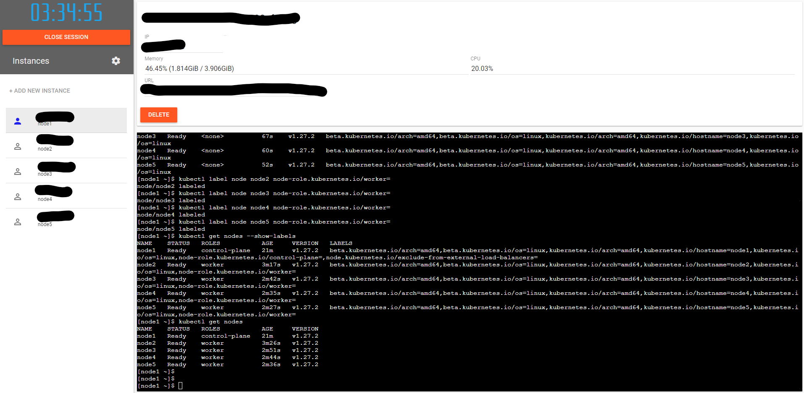

# 🐳 Docker and Kubernetes

Welcome to our Docker repository! Here you'll find a collection of Dockerfiles and Kubernetes clusters with configurations for various Docker images tailored to different purposes. Each Dockerfile provides a concise setup for specific tasks, ensuring easy deployment and management of Docker containers. 

Docker is a platform that enables developers to build, ship, and run applications as portable containers. These containers encapsulate everything needed to run an application, including the code, runtime, system tools, libraries, and settings. By utilizing Docker, developers can ensure consistency in their development environments across different machines and deployment targets. Docker's lightweight nature and efficient resource utilization make it an invaluable tool for both development and production environments alike.
 
 

 

### 📁 Repository

 |-- /Docker_Files

 |-- /Kubernetes_Clusters

 |-- /Minicube_Kubectl

 |-- /Screens

 |-- README.md

### 📝 Examples

 

## 📢 Additional Information

I hope you liked my repository, don’t forget to rate it and if you notice a code malfunction or any other errors.

Don’t hesitate to correct them and be able to improve your project for others
